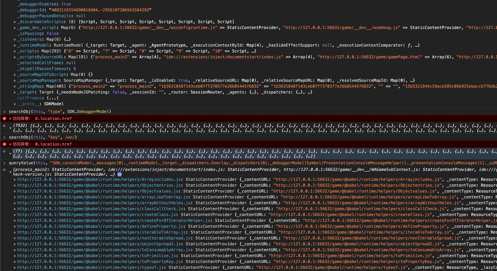

# searchProps

[English](./README.md) | [中文](./README.zh-CN.md)

这是一个用于搜索JavaScript对象属性的强大工具。在调试过程中，我们经常需要查找对象中的特定属性或值，searchProps工具允许您快速搜索对象中的所有信息，包括可见属性、不可见属性和Symbol属性。

## 安装

```bash
npm install search-props -g
```

## 使用方法

### 命令行使用

1. 在终端执行以下命令
```bash
searchProps
```

2. 将代码（Ctrl + V）粘贴到你需要的地方:
- 如开发者工具的控制台
- 如调试控制台
- 第三方库或者破解目标第三方应用程序中

### 在代码中使用

```js
import { searchProps, queryValueFromPath } from 'search-props';

// 搜索对象中的所有属性
const results = searchProps(myObject, 'all', 'propertyName');
console.log(results);

// 根据路径获取对象中的值
const value = queryValueFromPath(myObject, 'property.nestedArray[0].deepProperty');
console.log(value);
```

## API 说明

### searchProps

```js
/**
 * 对象搜索工具，支持按值、键、类型和全部四种方式搜索对象
 * @param {Object|Array} target - 要搜索的目标对象或数组
 * @param {string} searchType - 搜索类型："value"、"key"、"type" 或 "all"
 * @param {*|RegExp|Object} searchValue - 搜索值，可以是普通值、正则表达式或对象
 * @param {Object} [options] - 搜索选项
 * @param {Function} [options.customFilter] - 自定义过滤函数
 * @param {number} [options.maxDepth=0] - 最大搜索深度，<=0表示不限制深度
 * @returns {Array} - 包含匹配结果的数组
 */
function searchProps(target, searchType, searchValue, options = {});
```

#### 参数说明

- **target**: 要搜索的目标对象或数组
- **searchType**: 搜索类型
  - `'key'`: 按属性名搜索
  - `'value'`: 按属性值搜索
  - `'type'`: 按属性类型搜索
  - `'all'`: 同时搜索键、值和类型（默认）
- **searchValue**: 搜索值
  - 可以是普通值（字符串、数字等）
  - 可以是正则表达式（用于模式匹配）
  - 可以是对象（用于深度比较）
  - 当searchType为'type'时，可以是类型字符串（如'string', 'number', 'object', 'function', 'array', 'date', 'regexp'）或构造函数
- **options**: 可选配置
  - **customFilter**: 自定义过滤函数，接收(obj, key)两个参数，返回布尔值
  - **maxDepth**: 最大搜索深度，<=0表示不限制深度，>0限制递归搜索深度

#### 返回值

返回一个包含匹配结果的数组，每个结果对象包含以下属性：
- **path**: 属性的完整路径
- **key**: 属性名
- **value**: 属性值
- **type**: 属性值的类型

### queryValueFromPath

```js
/**
 * 根据路径字符串查询对象中的值
 * @param {Object|Array} target - 要查询的目标对象或数组
 * @param {string} path - 属性路径，例如 "obj.prop[0][Symbol(name)]"
 * @returns {*} - 查询到的值，如果路径无效则返回undefined
 */
function queryValueFromPath(target, path);
```

#### 参数说明

- **target**: 要查询的目标对象或数组
- **path**: 属性路径字符串
  - 支持点表示法：`obj.property`
  - 支持数组索引：`array[0]`
  - 支持Symbol属性：`obj[Symbol(name)]`

#### 返回值

返回查询到的值，如果路径无效则返回undefined

## 示例

### 按属性名搜索

```js
const obj = { name: 'John', age: 30, info: { email: 'john@example.com' } };
const results = searchProps(obj, 'key', 'name');
// 结果: [{ path: 'name', key: 'name', value: 'John', type: 'string' }]
```

### 使用正则表达式搜索

```js
const obj = { name: 'John', username: 'john_doe', email: 'john@example.com' };
const results = searchProps(obj, 'key', /name/);
// 结果: 匹配所有包含'name'的键
```

### 按类型搜索

```js
const obj = { name: 'John', age: 30, active: true, tags: ['user', 'admin'] };
const results = searchProps(obj, 'type', 'array');
// 结果: 匹配所有数组类型的属性
```

### 搜索Symbol属性

```js
const sym = Symbol('testSymbol');
const obj = { [sym]: 'Symbol value' };
const results = searchProps(obj, 'key', sym.toString());
// 结果: 匹配Symbol属性
```

### 使用自定义过滤器

```js
const obj = { name: 'John', _private: 'secret', age: 30 };
const results = searchProps(obj, 'all', null, {
  customFilter: (obj, key) => !String(key).startsWith('_')
});
// 结果: 排除所有以下划线开头的属性
```

### 根据路径获取值

```js
const obj = { users: [{ name: 'John', profile: { role: 'admin' } }] };
const role = queryValueFromPath(obj, 'users[0].profile.role');
// 结果: 'admin'
```

## 特性

- 支持搜索深层嵌套对象
- 支持搜索数组元素
- 支持搜索不可枚举属性
- 支持搜索Symbol属性
- 自动处理循环引用
- 支持使用正则表达式进行模式匹配
- 支持对象深度比较
- 提供详细的属性路径信息

